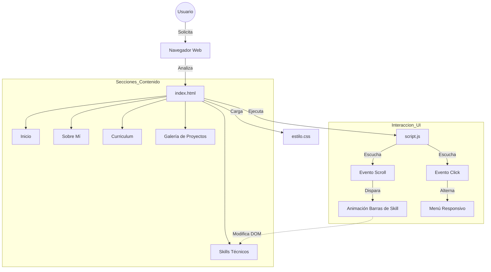

# Diego Rivera - Portafolio Profesional

   

🔗 **Ver Código en GitHub**: [https://github.com/dariverap/portafolio](https://github.com/dariverap/portafolio)  
🇺🇸 **English Version**: [README.md](./README.md)

---

## 👨‍💻 Introducción y Autor

Este repositorio aloja el código fuente de mi primer portafolio profesional, desarrollado a partir de mis primeros proyectos personales. Se trata de una aplicación web de página única (SPA) totalmente responsiva, diseñada para presentar habilidades técnicas, formación académica y un portafolio de proyectos de desarrollo de software.

La arquitectura se centra en la **Eficiencia** y la **Experiencia de Usuario (UX)**, utilizando tecnologías web nativas para asegurar una carga rápida y compatibilidad universal entre navegadores, eliminando la dependencia de frameworks pesados para este caso de uso específico.

> **Creado por Diego Rivera**  
---

## 🏗 Arquitectura Visual

### Árbol del Proyecto
Estructura optimizada para despliegue estático.

```bash
.
├── img/                # (Implícito) Contiene activos visuales como imágenes del hero y miniaturas de proyectos
├── estilo.css          # Hoja de estilos principal (tipografía, layout y media queries)
├── index.html          # Punto de entrada HTML5 semántico que define la estructura del DOM
└── script.js           # Lógica del lado del cliente para navegación y animaciones por scroll
```

### Flujo de la Aplicación
El siguiente diagrama ilustra el flujo de interacción del lado del cliente, vinculando la estructura DOM con el motor de estilos y la lógica de comportamiento.



---

## 🛠 Stack Tecnológico

*   **Core**: HTML5, CSS3, JavaScript (ES6+)
*   **Fuentes**: Google Fonts (Righteous, Work Sans)
*   **Iconos**: FontAwesome 6.1.2 (via CDN)
*   **Estilos**: Flexbox, CSS Grid, Media Queries, Transiciones/Animaciones CSS
*   **Despliegue**: Hosting Estático (Compatible con GitHub Pages)

---

## 🚀 Instalación y Configuración

Dado que es un proyecto web estático, no se requiere un proceso de compilación ni gestores de paquetes (npm/yarn) para ejecutarlo localmente.

1.  **Clonar el repositorio**:
    ```bash
    git clone https://github.com/dariverap/portafolio.git
    cd portafolio
    ```

2.  **Ejecutar Localmente**:
    *   **Opción A (Simple)**: Haz doble clic en el archivo `index.html` para abrirlo en tu navegador predeterminado.
    *   **Opción B (Live Server)**: Si usas VS Code con la extensión Live Server:
        *   Click derecho en `index.html`
        *   Seleccionar "Open with Live Server"

3.  **Despliegue**:
    *   Hacer push a la rama `gh-pages` o configurar GitHub Pages en los ajustes del repositorio para servir desde la raíz de la rama `main`.

---

*© 2022 Diego Rivera. All rights reserved.*
