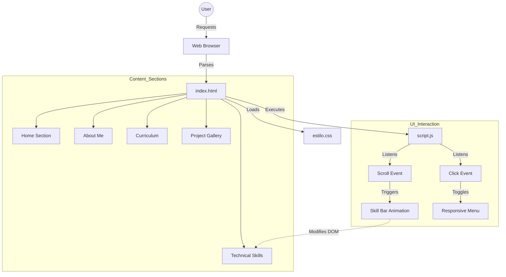

# Diego Rivera - Professional Portfolio

   

🔗 **View Code on GitHub**: [https://github.com/dariverap/portafolio](https://github.com/dariverap/portafolio)  
🇪🇸 **Versión en Español**: [README.es.md](./README.es.md)

---

## 👨‍💻 Introduction & Author

This repository hosts the source code of my first professional portfolio, developed from my first personal projects. It is a responsive, single-page application (SPA) designed to showcase technical skills, academic background, and a portfolio of software development projects.

The architecture focuses on **Performance** and **Accessibility**, utilizing vanilla web technologies to ensure lightweight load times and maximum cross-browser compatibility without the overhead of heavy frameworks.

> **Created by Diego Rivera**  

---

## 🏗 Visual Architecture

### Project Tree
A streamlined structure for a static web deployment.

```bash
.
├── img/                # (Implied) Contains visual assets like hero images and project thumbnails
├── estilo.css          # Main stylesheet handling typography, layout, and responsive media queries
├── index.html          # Semantic HTML5 entry point defining the DOM structure
└── script.js           # Client-side logic for navigation toggling and scroll-triggered animations
```

### Application Flow
The following diagram illustrates the client-side interaction flow, linking the DOM structure with the styling engine and behavioral logic.



---

## 🛠 Tech Stack

*   **Core**: HTML5, CSS3, JavaScript (ES6+)
*   **Fonts**: Google Fonts (Righteous, Work Sans)
*   **Icons**: FontAwesome 6.1.2 (via CDN)
*   **Styling**: Flexbox, CSS Grid, Media Queries, CSS Transitions/Animations
*   **Deploy Target**: Static Hosting (GitHub Pages compatible)

---

## 🚀 Installation & Setup

Since this is a static web project, no build process or package manager (npm/yarn) is strictly required to run it locally.

1.  **Clone the repository**:
    ```bash
    git clone https://github.com/dariverap/portafolio.git
    cd portafolio
    ```

2.  **Run Locally**:
    *   **Option A (Simple)**: Double-click `index.html` to open it in your default browser.
    *   **Option B (Live Server)**: If using VS Code with the Live Server extension:
        *   Right-click `index.html`
        *   Select "Open with Live Server"

3.  **Deployment**:
    *   Push to the `gh-pages` branch or configure GitHub Pages settings to serve from the `main` branch root.

---

*© 2022 Diego Rivera. All rights reserved.*
